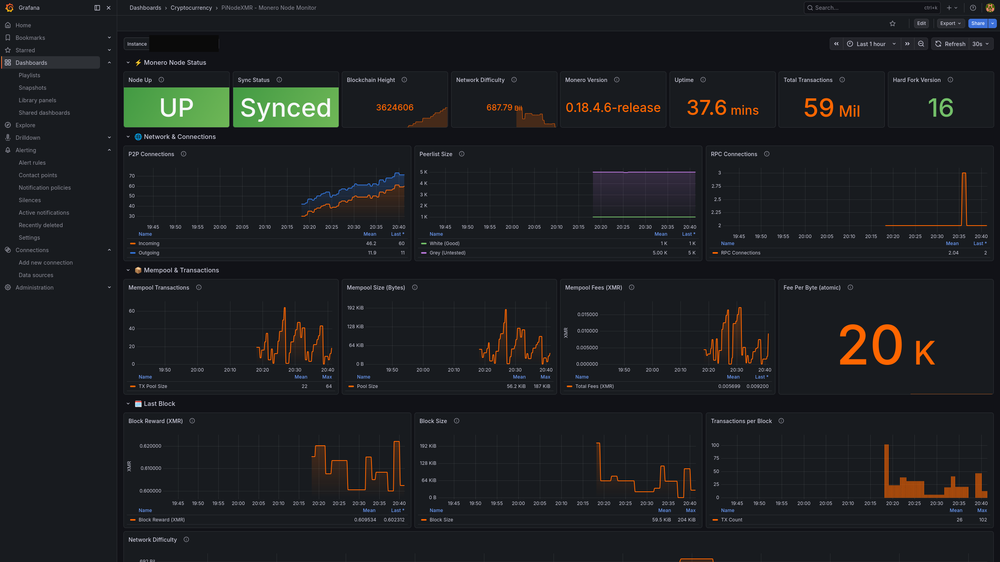
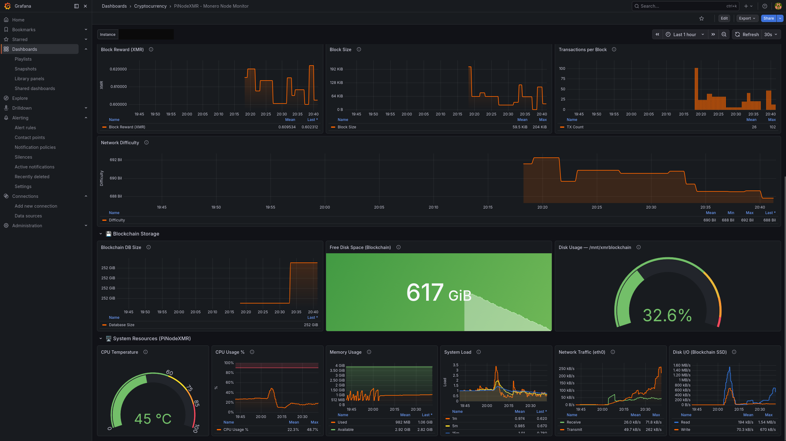

# PiNodeXMR Grafana Dashboard

A comprehensive Grafana monitoring dashboard for [PiNodeXMR](https://github.com/shermand100/PiNodeXMR) Monero full nodes. Tracks blockchain sync status, network connections, mempool activity, mining difficulty, disk usage, and device health — all through Prometheus and node_exporter's textfile collector.


## Screenshots





## Table of Contents

- [Overview](#overview)
- [Architecture](#architecture)
- [Dashboard Sections](#dashboard-sections)
- [Prerequisites](#prerequisites)
- [Installation](#installation)
  - [Step 1: Install Dependencies on PiNodeXMR](#step-1-install-dependencies-on-pinodexmr)
  - [Step 2: Deploy the Monerod Exporter](#step-2-deploy-the-monerod-exporter)
  - [Step 3: Configure Prometheus](#step-3-configure-prometheus)
  - [Step 4: Import the Grafana Dashboard](#step-4-import-the-grafana-dashboard)
- [Configuration](#configuration)
  - [Exporter Polling Interval](#exporter-polling-interval)
  - [RPC Port](#rpc-port)
  - [Textfile Collector Directory](#textfile-collector-directory)
- [Changing RPC Credentials](#changing-rpc-credentials)
- [Upgrading](#upgrading)
- [Uninstalling](#uninstalling)
- [Troubleshooting](#troubleshooting)
- [Metrics Reference](#metrics-reference)
- [Contributing](#contributing)
- [License](#license)

## Overview

This project provides:

1. **`monerod-exporter.sh`** — A bash script that runs as a systemd service on your PiNodeXMR device. It queries the monerod JSON-RPC API every 30 seconds and writes 30+ Prometheus-formatted metrics to a `.prom` file for node_exporter's textfile collector.

2. **`pinodexmr-dashboard.json`** — A Grafana dashboard with 34 panels (28 data panels + 6 row sections) that visualizes all collected metrics.

3. **`deploy-exporter.sh`** — An automated deployment script that installs and configures everything on the PiNodeXMR device.

### Why Textfile Collector?

The monerod RPC API uses HTTP digest authentication. Most Grafana datasource plugins (including Infinity) only support basic auth. Rather than building a custom HTTP exporter, this project uses the battle-tested approach of writing Prometheus metrics to a `.prom` file that node_exporter serves via its [textfile collector](https://github.com/prometheus/node_exporter#textfile-collector). This means:

- **No additional ports to open** — metrics flow through the existing node_exporter endpoint (port 9100)
- **No credentials stored in Grafana** — the exporter runs locally on the PiNodeXMR and reads credentials from PiNodeXMR's own variable files
- **Zero additional dependencies** beyond `curl` and `jq`

## Architecture

```
┌─────────────────────────────────────────┐
│            PiNodeXMR Device             │
│                                         │
│  ┌──────────┐     ┌──────────────────┐  │
│  │ monerod  │◄────│ monerod-exporter │  │
│  │ RPC:1808x│     │   (systemd)      │  │
│  └──────────┘     └────────┬─────────┘  │
│                            │             │
│                   writes .prom file      │
│                            │             │
│                   ┌────────▼─────────┐  │
│                   │  node_exporter   │  │
│                   │  :9100           │  │
│                   │  (textfile       │  │
│                   │   collector)     │  │
│                   └────────┬─────────┘  │
└────────────────────────────┼────────────┘
                             │
                      scrapes :9100
                             │
                    ┌────────▼─────────┐
                    │   Prometheus     │
                    │   Server         │
                    └────────┬─────────┘
                             │
                    ┌────────▼─────────┐
                    │    Grafana       │
                    │   Dashboard      │
                    └──────────────────┘
```

## Dashboard Sections

The dashboard is organized into 6 sections with 28 data panels:

| Section | Panels | Description |
|---------|--------|-------------|
| **Node Status** | 7 | Sync status, node up/down, blockchain height, sync progress, uptime, version, update availability |
| **Network & Connections** | 5 | Incoming/outgoing/RPC connections over time, white/grey peerlist sizes |
| **Blockchain & Mining** | 4 | Mining difficulty, cumulative difficulty, total transactions, fee estimates |
| **Mempool** | 4 | Pool size (tx count), pool bytes, pool fees, double spend attempts |
| **Last Block** | 4 | Block reward, block size, transactions per block, block timestamp/age |
| **Storage & Device** | 4 | Database size, free disk space, disk usage percentage, CPU/SoC temperature |

## Prerequisites

### On the PiNodeXMR Device

- **PiNodeXMR** installed and running (the exporter reads configuration from PiNodeXMR's standard variable files in `/home/pinodexmr/variables/`)
- **monerod** running with RPC enabled (PiNodeXMR configures this automatically)
- **node_exporter** installed and running (PiNodeXMR ships with this — typically v1.x+)
- **jq** — JSON processor (install with `sudo apt install jq` if not present)
- **curl** — HTTP client (pre-installed on most Linux distributions)

### On the Monitoring Server

- **Prometheus** — configured to scrape the PiNodeXMR's node_exporter endpoint
- **Grafana** — v10.0+ (tested with v12.4.0)

## Installation

### Step 1: Install Dependencies on PiNodeXMR

SSH into your PiNodeXMR device:

```bash
ssh pinodexmr@<your-pinodexmr-ip>
```

Install required packages if not already present:

```bash
sudo apt update && sudo apt install -y jq curl
```

Verify node_exporter is running:

```bash
systemctl is-active node_exporter
# Should output: active
```

### Step 2: Deploy the Monerod Exporter

There are two ways to deploy: automated or manual.

#### Option A: Automated Deployment (Recommended)

From any machine that can SSH to the PiNodeXMR:

```bash
# Clone the repository
git clone https://github.com/ChiefGyk3D/PiNodeXMR_Grafana_Dashboard.git
cd PiNodeXMR_Grafana_Dashboard

# Copy files to the PiNodeXMR
scp monerod-exporter.sh pinodexmr@<your-pinodexmr-ip>:/home/pinodexmr/
scp monerod-exporter.service /tmp/monerod-exporter.service
scp deploy-exporter.sh /tmp/deploy-exporter.sh

# Copy service file and deploy script to PiNodeXMR
scp monerod-exporter.service pinodexmr@<your-pinodexmr-ip>:/tmp/
scp deploy-exporter.sh pinodexmr@<your-pinodexmr-ip>:/tmp/

# Run the deployment script on the PiNodeXMR (requires sudo)
ssh pinodexmr@<your-pinodexmr-ip> 'sudo bash /tmp/deploy-exporter.sh'
```

#### Option B: Manual Deployment

SSH into the PiNodeXMR and run these commands:

```bash
# 1. Copy the exporter script to the pinodexmr home directory
# (transfer monerod-exporter.sh to /home/pinodexmr/ first)
chmod +x /home/pinodexmr/monerod-exporter.sh

# 2. Create the textfile collector directory
sudo mkdir -p /var/lib/node_exporter/textfile_collector
sudo chown pinodexmr:pinodexmr /var/lib/node_exporter/textfile_collector

# 3. Update node_exporter to enable the textfile collector
# Edit /etc/systemd/system/node_exporter.service and change the ExecStart line:
#   ExecStart=/usr/local/bin/node_exporter --collector.textfile.directory=/var/lib/node_exporter/textfile_collector

# 4. Install the monerod-exporter service
sudo cp monerod-exporter.service /etc/systemd/system/
sudo systemctl daemon-reload
sudo systemctl restart node_exporter
sudo systemctl enable monerod-exporter
sudo systemctl start monerod-exporter

# 5. Verify both services are running
systemctl is-active node_exporter
systemctl is-active monerod-exporter
```

#### Verify Metrics Are Flowing

After deployment, verify that metrics are being collected:

```bash
# Check the .prom file is being updated
cat /var/lib/node_exporter/textfile_collector/monerod.prom

# Check via node_exporter HTTP endpoint
curl -s http://localhost:9100/metrics | grep monerod_height
```

You should see output like:
```
monerod_height 3624600
```

### Step 3: Configure Prometheus

Add the PiNodeXMR as a scrape target in your Prometheus configuration (`prometheus.yml`):

```yaml
scrape_configs:
  - job_name: 'node'
    scrape_interval: 30s
    static_configs:
      - targets: ['<your-pinodexmr-ip>:9100']
        labels:
          instance_name: 'pinodexmr'
          role: 'crypto-node'
```

Reload Prometheus:

```bash
# If running as a systemd service:
sudo systemctl reload prometheus

# If running in Docker:
docker restart prometheus
# Or send SIGHUP:
docker kill -s HUP prometheus
```

Verify Prometheus is scraping the metrics:

```bash
curl -s 'http://<prometheus-host>:9090/api/v1/query?query=monerod_height'
```

### Step 4: Import the Grafana Dashboard

1. Open Grafana in your browser
2. Navigate to **Dashboards** → **Import** (or go to `/dashboard/import`)
3. Click **Upload JSON file** and select `pinodexmr-dashboard.json`
4. On the import screen:
   - Select your **Prometheus** datasource from the dropdown
   - Optionally change the dashboard name or folder
5. Click **Import**
6. The `instance` dropdown at the top of the dashboard will auto-populate with your PiNodeXMR's node_exporter instance — select it if not already selected

## Configuration

### Exporter Polling Interval

The default polling interval is 30 seconds. To change it, edit `monerod-exporter.sh` on the PiNodeXMR:

```bash
# In /home/pinodexmr/monerod-exporter.sh
INTERVAL=30  # Change to desired seconds (minimum recommended: 15)
```

Then restart the service:

```bash
sudo systemctl restart monerod-exporter
```

### RPC Port

The exporter reads the RPC port from PiNodeXMR's variable file at `/home/pinodexmr/variables/monero-port.sh`. If you've changed the default port (18081) through PiNodeXMR's interface, no additional configuration is needed — the exporter picks it up automatically.

### Textfile Collector Directory

The default directory is `/var/lib/node_exporter/textfile_collector/`. If you need to change it, update both:

1. The `TEXTFILE_DIR` variable in `monerod-exporter.sh`
2. The `--collector.textfile.directory` flag in the node_exporter service file
3. The `ReadWritePaths` directive in `monerod-exporter.service`

## Changing RPC Credentials

**No action is needed when you change your monerod RPC username or password.** The exporter reads credentials from PiNodeXMR's own variable files on every loop iteration:

- `/home/pinodexmr/variables/RPCu.sh` — Contains the RPC username
- `/home/pinodexmr/variables/RPCp.sh` — Contains the RPC password

When PiNodeXMR updates these files (through its web interface or settings), the exporter will automatically use the new credentials on its next polling cycle (within 30 seconds). No restart is required.

If you change credentials through a method other than PiNodeXMR's interface (e.g., manually editing the files), ensure the variable files are updated to match:

```bash
# /home/pinodexmr/variables/RPCu.sh should contain:
#!/bin/sh
RPCu=your_username

# /home/pinodexmr/variables/RPCp.sh should contain:
#!/bin/sh
RPCp=your_password
```

## Upgrading

To update to a newer version of the exporter or dashboard:

```bash
# Pull the latest version
cd PiNodeXMR_Grafana_Dashboard
git pull

# Re-deploy the exporter to the PiNodeXMR
scp monerod-exporter.sh pinodexmr@<your-pinodexmr-ip>:/home/pinodexmr/
ssh pinodexmr@<your-pinodexmr-ip> 'sudo systemctl restart monerod-exporter'

# Re-import the dashboard in Grafana
# (Dashboards → Import → Upload JSON → select pinodexmr-dashboard.json)
# Choose "Overwrite" if prompted about an existing dashboard with the same UID
```

## Uninstalling

### Remove the Exporter from PiNodeXMR

```bash
ssh pinodexmr@<your-pinodexmr-ip>

# Stop and disable the service
sudo systemctl stop monerod-exporter
sudo systemctl disable monerod-exporter

# Remove files
sudo rm /etc/systemd/system/monerod-exporter.service
rm /home/pinodexmr/monerod-exporter.sh
sudo rm /var/lib/node_exporter/textfile_collector/monerod.prom

# Reload systemd
sudo systemctl daemon-reload
```

### Remove the Dashboard from Grafana

1. Open the dashboard in Grafana
2. Click the gear icon (Dashboard settings)
3. Scroll down and click **Delete Dashboard**

### Remove from Prometheus

Remove or comment out the PiNodeXMR target in your `prometheus.yml` and reload Prometheus. (Only do this if you also want to stop collecting standard node_exporter system metrics from the device.)

## Troubleshooting

### Exporter service is not running

```bash
# Check service status
sudo systemctl status monerod-exporter

# View recent logs
sudo journalctl -u monerod-exporter -n 50 --no-pager

# Common issue: variable files not found
ls -la /home/pinodexmr/variables/RPCu.sh /home/pinodexmr/variables/RPCp.sh /home/pinodexmr/variables/monero-port.sh
```

### Metrics show `monerod_up 0`

This means the exporter cannot reach the monerod RPC:

```bash
# Check if monerod is running
systemctl status moneroStatus.service
# or
ps aux | grep monerod

# Test RPC manually (source credentials first)
source /home/pinodexmr/variables/RPCu.sh
source /home/pinodexmr/variables/RPCp.sh
source /home/pinodexmr/variables/monero-port.sh
DEVICE_IP=$(hostname -I | awk '{print $1}')
curl -sf -u "${RPCu}:${RPCp}" --digest -X POST "http://${DEVICE_IP}:${MONERO_PORT}/json_rpc" \
    -d '{"jsonrpc":"2.0","id":"0","method":"get_info"}' \
    -H 'Content-Type: application/json'
```

### No metrics appearing in Prometheus

```bash
# 1. Verify node_exporter has textfile collector enabled
grep textfile /etc/systemd/system/node_exporter.service
# Should show: --collector.textfile.directory=/var/lib/node_exporter/textfile_collector

# 2. Verify the .prom file exists and is recent
ls -la /var/lib/node_exporter/textfile_collector/monerod.prom

# 3. Test node_exporter endpoint directly
curl -s http://localhost:9100/metrics | grep monerod_

# 4. Check Prometheus target status at http://<prometheus>:9090/targets
```

### Dashboard shows "No data"

1. Verify the correct Prometheus datasource is selected during import
2. Check the `instance` dropdown at the top of the dashboard — select your PiNodeXMR's instance
3. Verify metrics exist in Prometheus: visit `http://<prometheus>:9090/graph` and query `monerod_up`
4. Ensure Prometheus can reach the PiNodeXMR's node_exporter port (9100) — check firewall rules

### Permissions errors

```bash
# Ensure the textfile collector directory is writable by the pinodexmr user
sudo chown pinodexmr:pinodexmr /var/lib/node_exporter/textfile_collector
ls -la /var/lib/node_exporter/textfile_collector/

# Ensure the exporter script is executable
chmod +x /home/pinodexmr/monerod-exporter.sh
```

### jq not found

```bash
sudo apt update && sudo apt install -y jq
```

## Metrics Reference

All metrics are exposed under the `monerod_` or `pinodexmr_` prefix.

### Node Status Metrics

| Metric | Type | Description |
|--------|------|-------------|
| `monerod_up` | gauge | Whether monerod RPC is reachable (1=up, 0=down) |
| `monerod_info{version}` | gauge | Monerod version info label (always 1) |
| `monerod_height` | gauge | Current blockchain height |
| `monerod_target_height` | gauge | Target sync height from peers |
| `monerod_sync_progress` | gauge | Sync progress percentage (0–100) |
| `monerod_synchronized` | gauge | Whether the node is fully synchronized (1=yes, 0=no) |
| `monerod_busy_syncing` | gauge | Whether the node is currently syncing (1=yes, 0=no) |
| `monerod_start_time_seconds` | gauge | Unix timestamp when monerod was started |
| `monerod_update_available` | gauge | Whether a monerod update is available (1=yes, 0=no) |

### Network Metrics

| Metric | Type | Description |
|--------|------|-------------|
| `monerod_connections_incoming` | gauge | Number of incoming P2P connections |
| `monerod_connections_outgoing` | gauge | Number of outgoing P2P connections |
| `monerod_rpc_connections` | gauge | Number of active RPC connections |
| `monerod_white_peerlist_size` | gauge | Number of peers in the white (known good) peerlist |
| `monerod_grey_peerlist_size` | gauge | Number of peers in the grey (untested) peerlist |

### Blockchain & Mining Metrics

| Metric | Type | Description |
|--------|------|-------------|
| `monerod_difficulty` | gauge | Current network mining difficulty |
| `monerod_cumulative_difficulty` | gauge | Cumulative difficulty of the chain |
| `monerod_tx_count` | gauge | Total number of transactions in the blockchain |
| `monerod_fee_per_byte_atomic` | gauge | Estimated fee per byte in atomic units |

### Mempool Metrics

| Metric | Type | Description |
|--------|------|-------------|
| `monerod_tx_pool_size` | gauge | Number of transactions in the mempool |
| `monerod_pool_bytes_total` | gauge | Total bytes of transactions in the mempool |
| `monerod_pool_txs_total` | gauge | Total transactions in mempool (from pool stats) |
| `monerod_pool_fee_total` | gauge | Total fees in the mempool (atomic units) |
| `monerod_pool_double_spends` | gauge | Number of double spend attempts in pool |

### Block Metrics

| Metric | Type | Description |
|--------|------|-------------|
| `monerod_last_block_reward` | gauge | Block reward of the last block (atomic units) |
| `monerod_last_block_size_bytes` | gauge | Size of the last block in bytes |
| `monerod_last_block_txes` | gauge | Number of transactions in the last block |
| `monerod_last_block_timestamp` | gauge | Unix timestamp of the last block |

### Hard Fork Metrics

| Metric | Type | Description |
|--------|------|-------------|
| `monerod_hardfork_version` | gauge | Current hard fork version |
| `monerod_hardfork_voting` | gauge | Hard fork version being voted for |
| `monerod_hardfork_enabled` | gauge | Whether the current hard fork is enabled (1=yes, 0=no) |

### Storage & Device Metrics

| Metric | Type | Description |
|--------|------|-------------|
| `monerod_database_size_bytes` | gauge | Size of the blockchain LMDB database in bytes |
| `monerod_free_space_bytes` | gauge | Free disk space on blockchain volume in bytes |
| `pinodexmr_cpu_temp_celsius` | gauge | SoC temperature of the PiNodeXMR device in Celsius |

## Contributing

Contributions are welcome! Please:

1. Fork the repository
2. Create a feature branch (`git checkout -b feature/my-improvement`)
3. Commit your changes (`git commit -am 'Add new feature'`)
4. Push to the branch (`git push origin feature/my-improvement`)
5. Open a Pull Request

### Ideas for Contributions

- P2Pool mining metrics integration
- Multi-node support (multiple PiNodeXMR devices on one dashboard)
- Alerting rules for node down, sync stalled, disk full
- Grafana dashboard screenshots for the README
- Support for non-PiNodeXMR monerod installations

## Related Projects

| Repository | Description |
|-----------|-------------|
| [siem-docker-stack](https://github.com/ChiefGyk3D/siem-docker-stack) | Dockerized SIEM/SOC stack with hot/warm tiering (OpenSearch, Wazuh, Grafana, Logstash, Prometheus) |
| [pfsense_siem_stack](https://github.com/ChiefGyk3D/pfsense_siem_stack) | pfSense-side SIEM integration (Suricata, Telegraf, pfBlockerNG, 30+ docs) |

## License

This project is licensed under the MIT License — see the [LICENSE](LICENSE) file for details.

## Acknowledgments

- [PiNodeXMR](https://github.com/shermand100/PiNodeXMR) — The Monero node distribution this dashboard is designed for
- [Prometheus node_exporter](https://github.com/prometheus/node_exporter) — The textfile collector approach that makes this possible
- [Monero Project](https://www.getmonero.org/) — The monerod JSON-RPC API

## 💬 Support

- **Issues**: [GitHub Issues](https://github.com/ChiefGyk3D/PiNodeXMR_Grafana_Dashboard/issues)
- **Discussions**: [GitHub Discussions](https://github.com/ChiefGyk3D/PiNodeXMR_Grafana_Dashboard/discussions)

---

## 💝 Support This Project

If you find PiNodeXMR Grafana Dashboard useful, consider supporting continued development.
Everything is also collected at **[support.chiefgyk3d.com](https://support.chiefgyk3d.com)**.

### Recurring Support

<div align="center">
<table>
  <tr>
    <td align="center" width="150">
      <a href="https://patreon.com/chiefgyk3d" title="Patreon">
        <br>
        <sub><b>Patreon</b></sub>
      </a>
    </td>
    <td align="center" width="150">
      <a href="https://streamelements.com/chiefgyk3d/tip" title="StreamElements">
        <br>
        <sub><b>StreamElements</b></sub>
      </a>
    </td>
    <td align="center" width="150">
      <a href="https://shop.chiefgyk3d.com/" title="Merch Store">
        <br>
        <sub><b>Merch Store</b></sub>
      </a>
    </td>
  </tr>
</table>
</div>

### Cryptocurrency Tips

<div align="center">
<table>
  <tr>
    <td align="center" width="60"></td>
    <td><b>Bitcoin</b><br><code>bc1qztdzcy2wyavj2tsuandu4p0tcklzttvdnzalla</code></td>
  </tr>
  <tr>
    <td align="center" width="60"></td>
    <td><b>Monero</b><br><code>84Y34QubRwQYK2HNviezeH9r6aRcPvgWmKtDkN3EwiuVbp6sNLhm9ffRgs6BA9X1n9jY7wEN16ZEpiEngZbecXseUrW8SeQ</code></td>
  </tr>
  <tr>
    <td align="center" width="60"></td>
    <td><b>Ethereum</b><br><code>0x554f18cfB684889c3A60219BDBE7b050C39335ED</code></td>
  </tr>
  <tr>
    <td align="center" width="60"></td>
    <td><b>Solana</b><br><code>5T8h3HbyvHgLxwXgchRYbHSqRjZyAr8J7uwjLN9Fh8Jh</code></td>
  </tr>
</table>
</div>

---

## 👤 Author & Socials

<div align="center">
<table>
  <tr>
    <td align="center" width="90"><a href="https://social.chiefgyk3d.com/@chiefgyk3d" title="Mastodon"><br><sub>Mastodon</sub></a></td>
    <td align="center" width="90"><a href="https://bsky.app/profile/chiefgyk3d.com" title="Bluesky"><br><sub>Bluesky</sub></a></td>
    <td align="center" width="90"><a href="https://twitch.tv/chiefgyk3d" title="Twitch"><br><sub>Twitch</sub></a></td>
    <td align="center" width="90"><a href="https://www.youtube.com/channel/UCvFY4KyqVBuYd7JAl3NRyiQ" title="YouTube"><br><sub>YouTube</sub></a></td>
    <td align="center" width="90"><a href="https://kick.com/chiefgyk3d" title="Kick"><br><sub>Kick</sub></a></td>
    <td align="center" width="90"><a href="https://www.tiktok.com/@chiefgyk3d" title="TikTok"><br><sub>TikTok</sub></a></td>
    <td align="center" width="90"><a href="https://discord.chiefgyk3d.com" title="Discord"><br><sub>Discord</sub></a></td>
    <td align="center" width="90"><a href="https://matrix-invite.chiefgyk3d.com" title="Matrix"><br><sub>Matrix</sub></a></td>
  </tr>
</table>
</div>

<div align="center"><sub>Made with ❤️ by <a href="https://github.com/ChiefGyk3D">ChiefGyk3D</a></sub></div>
